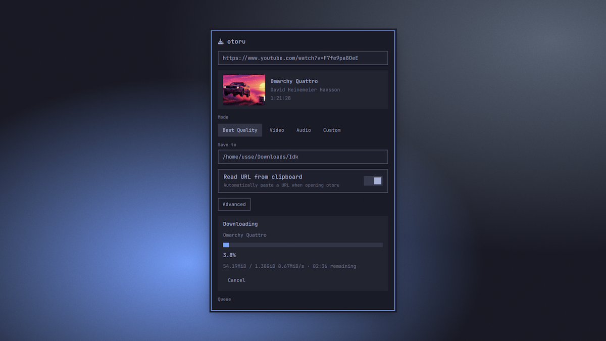

# Otoru

A lightweight, keyboard-first Quickshell bar widget for Omarchy that fronts `yt-dlp`. Paste a URL, press Enter, pick a mode, press Enter again to download.



## Features

- Universal `yt-dlp` support — works with any site `yt-dlp` supports.
- Clipboard URL auto-paste on open, without re-pasting already-downloaded URLs from the same session.
- Download modes: best quality, video, audio, and custom.
- Common video qualities (Best, 1080p, 720p, 480p) shown only when available.
- Common audio formats (best, MP3, Opus, M4A).
- Configurable download directory and advanced `yt-dlp` options.
- Minimal queue: add URLs, cancel or remove items, sequential downloads.
- Live download progress bar with percent, size, speed, and ETA.
- Desktop notifications on completion or failure.
- Friendly error messages from `yt-dlp` output, with a raw-log viewer and a "Retry as web client" option for blocked sources.
- Bar icon pulses while extracting or downloading.

## Requirements

- `yt-dlp` must be installed and available in `PATH`.

## Install

From the Omarchy plugin marketplace, or directly:

```
omarchy plugin add https://github.com/ussego/otoru --enable
```

## Uninstall

```bash
omarchy plugin remove ussego.otoru
```

The plugin is self-contained in its plugin folder — no systemd units, config files, background services, or download directories are created or left behind.

## Mouse actions

- **Left click** opens the panel.
- **Right click** also opens the panel (reserved for future quick actions).

## Keyboard shortcuts

Inside the panel:

- `enter`: extract the current URL or start the selected download.
- `tab` / `shift+tab`: move focus between the URL field, mode buttons, and action buttons.
- `escape`: close the panel.

## Workflow

1. Click the download icon in the bar to open otoru.
2. A URL is auto-pasted from the clipboard if the setting is enabled.
3. Press `Enter` to extract media information.
4. Pick a mode and quality or format.
5. Press `Enter` again to start the download.
6. Press `Escape` to close the panel.

## Settings

Settings are stored in `~/.config/omarchy/ussego.otoru.json`. The file is kept outside the plugin directory so Omarchy does not reload the widget when settings are saved.

Example:

```json
{
  "downloadDir": "/home/usse/Downloads",
  "autoClipboard": true,
  "audioFormat": "best",
  "quality": "best",
  "advancedVisible": false,
  "outputTemplate": "%(title)s.%(ext)s",
  "cookies": "",
  "cookiesFromBrowser": "brave",
  "cookiesProfile": "Default",
  "proxy": "",
  "rateLimit": "",
  "concurrentFragments": "",
  "customFormatSelector": "",
  "customArgs": ""
}
```

### Cookies

- **Cookies file path**: a Netscape-format cookies text file.
- **Cookies from browser**: live cookies from a supported browser (Brave, Chrome, Chromium, Edge, Firefox, Opera, Safari, Vivaldi, Whale).
- **Browser profile**: optional profile name or full browser config path, for example `Default`, `Profile 1`, or `/home/usse/.config/BraveSoftware/Brave-Origin`.

When a browser is selected, it takes precedence over the cookies file. Browser cookies are used for both extraction and download.

## IPC

The widget exposes `omarchy-shell` IPC targets under `ussego.otoru`:

```
omarchy-shell ussego.otoru open
omarchy-shell ussego.otoru close
omarchy-shell ussego.otoru show
omarchy-shell ussego.otoru hide
omarchy-shell ussego.otoru toggle
omarchy-shell ussego.otoru extract <url>
omarchy-shell ussego.otoru download
omarchy-shell ussego.otoru cancel
omarchy-shell ussego.otoru retry
omarchy-shell ussego.otoru clear
omarchy-shell ussego.otoru refresh
omarchy-shell ussego.otoru status
omarchy-shell ussego.otoru progress
```

## Keybinding

Add to `~/.config/hypr/bindings.lua`:

```lua
hl.unbind("SUPER + SHIFT + O")
o.bind("SUPER + SHIFT + O", "Open otoru", "omarchy-shell ussego.otoru open")
```

## License

MIT — see [LICENSE](LICENSE).
